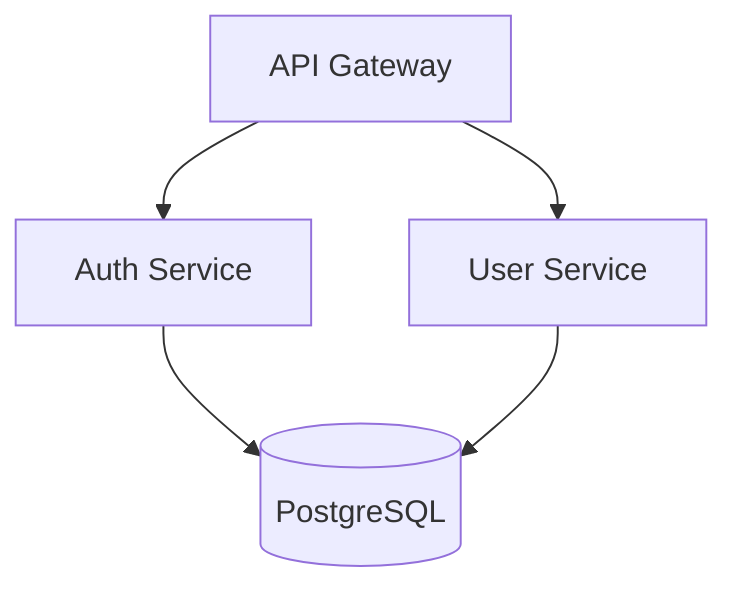

# Senior Architect

Architecture design and analysis tools for making informed technical decisions.

## Table of Contents

- [Quick Start](#quick-start)
- [Tools Overview](#tools-overview)
  - [Architecture Diagram Generator](#1-architecture-diagram-generator)
  - [Dependency Analyzer](#2-dependency-analyzer)
  - [Project Architect](#3-project-architect)
- [Decision Workflows](#decision-workflows)
  - [Database Selection](#database-selection-workflow)
  - [Architecture Pattern Selection](#architecture-pattern-selection-workflow)
  - [Monolith vs Microservices](#monolith-vs-microservices-decision)
- [Reference Documentation](#reference-documentation)
- [Tech Stack Coverage](#tech-stack-coverage)
- [Common Commands](#common-commands)

---

## Quick Start

```bash
# Generate architecture diagram from project
python scripts/architecture_diagram_generator.py ./my-project --format mermaid

# Analyze dependencies for issues
python scripts/dependency_analyzer.py ./my-project --output json

# Get architecture assessment
python scripts/project_architect.py ./my-project --verbose
```

---

## Tools Overview

### 1. Architecture Diagram Generator

Generates architecture diagrams from project structure in multiple formats.

**Solves:** "I need to visualize my system architecture for documentation or team discussion"

**Input:** Project directory path
**Output:** Diagram code (Mermaid, PlantUML, or ASCII)

**Supported diagram types:**
- `component` - Shows modules and their relationships
- `layer` - Shows architectural layers (presentation, business, data)
- `deployment` - Shows deployment topology

**Usage:**
```bash
# Mermaid format (default)
python scripts/architecture_diagram_generator.py ./project --format mermaid --type component

# PlantUML format
python scripts/architecture_diagram_generator.py ./project --format plantuml --type layer

# ASCII format (terminal-friendly)
python scripts/architecture_diagram_generator.py ./project --format ascii

# Save to file
python scripts/architecture_diagram_generator.py ./project -o architecture.md
```

**Example output (Mermaid):**


---

### 2. Dependency Analyzer

Analyzes project dependencies for coupling, circular dependencies, and outdated packages.

**Solves:** "I need to understand my dependency tree and identify potential issues"

**Input:** Project directory path
**Output:** Analysis report (JSON or human-readable)

**Analyzes:**
- Dependency tree (direct and transitive)
- Circular dependencies between modules
- Coupling score (0-100)
- Outdated packages

**Supported package managers:**
- npm/yarn (`package.json`)
- Python (`requirements.txt`, `pyproject.toml`)
- Go (`go.mod`)
- Rust (`Cargo.toml`)

**Usage:**
```bash
# Human-readable report
python scripts/dependency_analyzer.py ./project

# JSON output for CI/CD integration
python scripts/dependency_analyzer.py ./project --output json

# Check only for circular dependencies
python scripts/dependency_analyzer.py ./project --check circular

# Verbose mode with recommendations
python scripts/dependency_analyzer.py ./project --verbose
```

**Example output:**
```
Dependency Analysis Report
==========================
Total dependencies: 47 (32 direct, 15 transitive)
Coupling score: 72/100 (moderate)

Issues found:
- CIRCULAR: auth → user → permissions → auth
- OUTDATED: lodash 4.17.15 → 4.17.21 (security)

Recommendations:
1. Extract shared interface to break circular dependency
2. Update lodash to fix CVE-2020-8203
```

---

### 3. Project Architect

Analyzes project structure and detects architectural patterns, code smells, and improvement opportunities.

**Solves:** "I want to understand the current architecture and identify areas for improvement"

**Input:** Project directory path
**Output:** Architecture assessment report

**Detects:**
- Architectural patterns (MVC, layered, hexagonal, microservices indicators)
- Code organization issues (god classes, mixed concerns)
- Layer violations
- Missing architectural components

**Usage:**
```bash
# Full assessment
python scripts/project_architect.py ./project

# Verbose with detailed recommendations
python scripts/project_architect.py ./project --verbose

# JSON output
python scripts/project_architect.py ./project --output json

# Check specific aspect
python scripts/project_architect.py ./project --check layers
```

**Example output:**
```
Architecture Assessment
=======================
Detected pattern: Layered Architecture (confidence: 85%)

Structure analysis:
  ✓ controllers/  - Presentation layer detected
  ✓ services/     - Business logic layer detected
  ✓ repositories/ - Data access layer detected
  ⚠ models/       - Mixed domain and DTOs

Issues:
- LARGE FILE: UserService.ts (1,847 lines) - consider splitting
- MIXED CONCERNS: PaymentController contains business logic

Recommendations:
1. Split UserService into focused services
2. Move business logic from controllers to services
3. Separate domain models from DTOs
```

---

## Decision Workflows

### Database Selection Workflow

Use when choosing a database for a new project or migrating existing data.

**Step 1: Identify data characteristics**
| Characteristic | Points to SQL | Points to NoSQL |
|----------------|---------------|-----------------|
| Structured with relationships | ✓ | |
| ACID transactions required | ✓ | |
| Flexible/evolving schema | | ✓ |
| Document-oriented data | | ✓ |
| Time-series data | | ✓ (specialized) |

**Step 2: Evaluate scale requirements**
- <1M records, single region → PostgreSQL or MySQL
- 1M-100M records, read-heavy → PostgreSQL with read replicas
- >100M records, global distribution → CockroachDB, Spanner, or DynamoDB
- High write throughput (>10K/sec) → Cassandra or ScyllaDB

**Step 3: Check consistency requirements**
- Strong consistency required → SQL or CockroachDB
- Eventual consistency acceptable → DynamoDB, Cassandra, MongoDB

**Step 4: Document decision**
Create an ADR (Architecture Decision Record) with:
- Context and requirements
- Options considered
- Decision and rationale
- Trade-offs accepted

**Quick reference:**
```
PostgreSQL → Default choice for most applications
MongoDB    → Document store, flexible schema
Redis      → Caching, sessions, real-time features
DynamoDB   → Serverless, auto-scaling, AWS-native
TimescaleDB → Time-series data with SQL interface
```

---

### Architecture Pattern Selection Workflow

Use when designing a new system or refactoring existing architecture.

**Step 1: Assess team and project size**
| Team Size | Recommended Starting Point |
|-----------|---------------------------|
| 1-3 developers | Modular monolith |
| 4-10 developers | Modular monolith or service-oriented |
| 10+ developers | Consider microservices |

**Step 2: Evaluate deployment requirements**
- Single deployment unit acceptable → Monolith
- Independent scaling needed → Microservices
- Mixed (some services scale differently) → Hybrid

**Step 3: Consider data boundaries**
- Shared database acceptable → Monolith or modular monolith
- Strict data isolation required → Microservices with separate DBs
- Event-driven communication fits → Event-sourcing/CQRS

**Step 4: Match pattern to requirements**

| Requirement | Recommended Pattern |
|-------------|-------------------|
| Rapid MVP development | Modular Monolith |
| Independent team deployment | Microservices |
| Complex domain logic | Domain-Driven Design |
| High read/write ratio difference | CQRS |
| Audit trail required | Event Sourcing |
| Third-party integrations | Hexagonal/Ports & Adapters |

See `references/architecture_patterns.md` for detailed pattern descriptions.

---

### Monolith vs Microservices Decision

**Choose Monolith when:**
- [ ] Team is small (<10 developers)
- [ ] Domain boundaries are unclear
- [ ] Rapid iteration is priority
- [ ] Operational complexity must be minimized
- [ ] Shared database is acceptable

**Choose Microservices when:**
- [ ] Teams can own services end-to-end
- [ ] Independent deployment is critical
- [ ] Different scaling requirements per component
- [ ] Technology diversity is needed
- [ ] Domain boundaries are well understood

**Hybrid approach:**
Start with a modular monolith. Extract services only when:
1. A module has significantly different scaling needs
2. A team needs independent deployment
3. Technology constraints require separation

---

## Reference Documentation

Load these files for detailed information:

| File | Contains | Load when user asks about |
|------|----------|--------------------------|
| `references/architecture_patterns.md` | 9 architecture patterns with trade-offs, code examples, and when to use | "which pattern?", "microservices vs monolith", "event-driven", "CQRS" |
| `references/system_design_workflows.md` | 6 step-by-step workflows for system design tasks | "how to design?", "capacity planning", "API design", "migration" |
| `references/tech_decision_guide.md` | Decision matrices for technology choices | "which database?", "which framework?", "which cloud?", "which cache?" |

---

## Tech Stack Coverage

**Languages:** TypeScript, JavaScript, Python, Go, Swift, Kotlin, Rust
**Frontend:** React, Next.js, Vue, Angular, React Native, Flutter
**Backend:** Node.js, Express, FastAPI, Go, GraphQL, REST
**Databases:** PostgreSQL, MySQL, MongoDB, Redis, DynamoDB, Cassandra
**Infrastructure:** Docker, Kubernetes, Terraform, AWS, GCP, Azure
**CI/CD:** GitHub Actions, GitLab CI, CircleCI, Jenkins

---

## Common Commands

```bash
# Architecture visualization
python scripts/architecture_diagram_generator.py . --format mermaid
python scripts/architecture_diagram_generator.py . --format plantuml
python scripts/architecture_diagram_generator.py . --format ascii

# Dependency analysis
python scripts/dependency_analyzer.py . --verbose
python scripts/dependency_analyzer.py . --check circular
python scripts/dependency_analyzer.py . --output json

# Architecture assessment
python scripts/project_architect.py . --verbose
python scripts/project_architect.py . --check layers
python scripts/project_architect.py . --output json
```

---

## Getting Help

1. Run any script with `--help` for usage information
2. Check reference documentation for detailed patterns and workflows
3. Use `--verbose` flag for detailed explanations and recommendations
