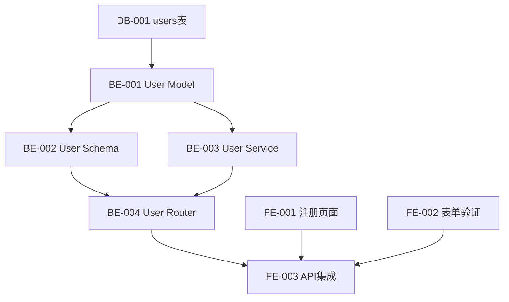

# Step 4: 任务分解 (Stories)

## 阶段信息
- **阶段**: 4/10 - 任务分解
- **Skill**: `dev-product_manager`
- **输入**: `docs/prd.md`, `docs/architecture.md`
- **产出物**: `docs/stories.md`

---

## 执行步骤

### 1. 加载上下文

读取并分析：
- `docs/prd.md` - 用户故事和验收标准
- `docs/architecture.md` - 技术架构和 API 设计

### 2. 加载 Skill

加载 `dev-product_manager` skill。

### 3. Epic 分解

将用户故事按功能模块分组为 Epic：

```
Epic: 用户管理
├── US-001: 用户注册
├── US-002: 用户登录
├── US-003: 密码重置
└── US-004: 个人资料

Epic: 订单管理
├── US-010: 创建订单
├── US-011: 订单列表
└── US-012: 订单详情
```

### 4. Story 拆分

将每个 User Story 拆分为技术 Story：

```
US-001: 用户注册
├── [DB-001] 创建 users 表
├── [BE-001] User Model
├── [BE-002] User Schema
├── [BE-003] User Service
├── [BE-004] User Router - POST /register
├── [FE-001] 注册页面组件
├── [FE-002] 表单验证
├── [FE-003] API 集成
└── [TEST-001] 注册功能测试
```

### 5. Story 格式

每个 Story 包含：

```markdown
## [BE-001] User Model

**类型**: Backend
**Epic**: 用户管理
**User Story**: US-001 用户注册
**优先级**: P0
**预估**: 2h

### 描述
创建用户数据模型，包含基本字段和关联关系。

### 验收标准
- [ ] 创建 `models/user.py`
- [ ] 包含字段: id, email, password_hash, name, created_at, updated_at
- [ ] 定义索引: email (unique)
- [ ] 通过 Model 检查脚本

### 依赖
- [DB-001] users 表已创建

### 文件
- `src/backend/models/user.py`

### 检查命令
```bash
python scripts/check-model.py --file src/backend/models/user.py
```
```

### 6. 依赖关系

建立 Story 之间的依赖：



### 7. 生成文档

创建 `docs/stories.md`：

```markdown
# {项目名称} - 开发任务清单

## 概览
- Epic 数量: {epic_count}
- Story 总数: {story_count}
- 预估总工时: {total_hours}h

## Epic 列表

### Epic 1: 用户管理
| ID | 标题 | 类型 | 优先级 | 预估 | 状态 |
|----|------|------|--------|------|------|
| DB-001 | users 表 | Database | P0 | 1h | pending |
| BE-001 | User Model | Backend | P0 | 2h | pending |
| ... | ... | ... | ... | ... | ... |

### Epic 2: ...

## Story 详情

### [DB-001] users 表
...

### [BE-001] User Model
...

## 依赖图

## Sprint 规划建议
### Sprint 1 (Week 1-2)
- 数据库设计
- 基础 Model 层
- 核心 API

### Sprint 2 (Week 3-4)
- 业务逻辑
- 前端页面
- 集成测试
```

### 8. 用户确认

展示任务清单，请用户确认：

```
[C] 确认 - 任务分解完整，继续下一阶段
[E] 编辑 - 修改 Story
[A] 添加 - 添加新 Story
[R] 重排 - 调整优先级或依赖
```

---

## 完成检查

- [ ] `docs/stories.md` 已创建
- [ ] 所有 User Story 已拆分
- [ ] 每个 Story 有明确的验收标准
- [ ] 依赖关系已定义
- [ ] 用户已确认

## 状态更新

```yaml
phases:
  stories:
    status: completed
    completed_at: {current_time}
    stats:
      epic_count: {n}
      story_count: {n}
      total_hours: {n}
```

## 下一步

→ 进入 `step-05-database.md`
