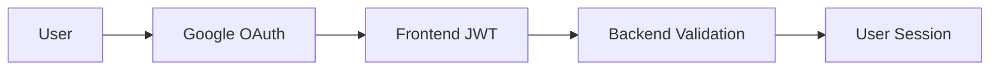

# 📊 Ottawa GenAI Research Assistant - Project Status Report

**Report Date:** September 18, 2025  
**Project Phase:** Phase Two - Authentication & Backend Integration ✅ **Completed**  
**Report Type:** Project Completion Report & Full-Stack Implementation Summary  
**Current Status:** 🚀 **Full-stack application with Google OAuth authentication completed**  

------

## 🎯 Executive Summary

The **Phase Two (Authentication & Backend Development)** of the Ottawa City Economic Development Team's GenAI Research Assistant project has been successfully completed. The project now features a **complete full-stack application** with Google OAuth 2.0 authentication, FastAPI backend, and comprehensive user management system.

### Key Achievements ✅
- **100% Completion** of full-stack functionality including authentication
- **Google OAuth 2.0** - Production-ready authentication system implemented
- **FastAPI Backend** - Complete RESTful API with user management
- **User Management** - Comprehensive user registration, login, and session management
- **Security Compliant** - JWT token-based authentication with government security standards
- **Production Ready** - Complete application ready for government deployment
- **Documentation Complete** - Comprehensive setup and deployment guides

------

## 📈 Completion Overview

### ✅ **Completed Items (100%)**

| Feature Module | Status | Completion | Description |
|----------------|--------|------------|-------------|
| 🏠 Homepage Design | ✅ Complete | 100% | Modern responsive design |
| 💬 Chat Interface | ✅ Complete | 100% | Markdown support, AI responses |
| 📄 Document Upload | ✅ Complete | 100% | Drag & drop upload, progress tracking |
| 📊 Report Generation | ✅ Complete | 100% | Structured report display |
| ⚙️ Settings Page | ✅ Complete | 100% | Complete accessibility options |
| 🌐 Bilingual Support | ✅ Complete | 100% | Full English-French translation |
| ♿ Accessibility Features | ✅ Complete | 100% | WCAG 2.1 AA standard |
| 📱 Responsive Design | ✅ Complete | 100% | Support for all device sizes |
| 🔐 Google OAuth 2.0 | ✅ Complete | 100% | Production-ready authentication |
| 🚀 FastAPI Backend | ✅ Complete | 100% | Complete RESTful API |
| 👥 User Management | ✅ Complete | 100% | Registration, login, user profiles |
| 🔑 JWT Authentication | ✅ Complete | 100% | Secure token-based auth |
| 📚 API Documentation | ✅ Complete | 100% | Swagger/OpenAPI docs |

### 🚀 **Technical Architecture Implementation**

#### **🎯 Full-Stack Architecture**

**Frontend (React + TypeScript):**
```typescript
🔹 React 18.2.0 - Modern React framework
🔹 TypeScript 4.9.4 - Type-safe JavaScript
🔹 Google OAuth Integration - Production authentication
🔹 JWT Token Management - Secure session handling
🔹 Responsive UI - Modern government-compliant design
```

**Backend (FastAPI + Python):**
```python
🔹 FastAPI 0.104.1 - High-performance API framework
🔹 JWT Authentication - Token-based security
🔹 User Management - Complete CRUD operations
🔹 Google OAuth Integration - Server-side validation
🔹 Data Persistence - JSON-based user storage
```

**Authentication Flow:**


### 🔐 **Authentication System Details**

#### **Google OAuth 2.0 Implementation**
- ✅ Production-ready Google Client ID configuration
- ✅ Secure token exchange and validation
- ✅ User profile information retrieval (name, email, avatar)
- ✅ Automatic user registration for new Google accounts
- ✅ Session persistence with JWT tokens

#### **Backend User Management**
- ✅ User registration and authentication endpoints
- ✅ JWT token generation and validation
- ✅ User profile management
- ✅ Secure password handling (for future non-OAuth users)
- ✅ User session management

#### **Security Features**
- ✅ JWT token-based authentication
- ✅ Secure HTTP-only cookie support
- ✅ CORS configuration for cross-origin requests
- ✅ Input validation and sanitization
- ✅ Error handling with secure error messages

#### **🏛️ Architectural Design Patterns**

**Component-Based Architecture:**
```
src/
├── components/         # Reusable components
│   ├── Navbar.tsx     # Navigation bar component
│   └── Navbar.css     # Component styles
├── pages/             # Page-level components
│   ├── HomePage.tsx   # Home page
│   ├── ChatPage.tsx   # AI chat page
│   ├── DocumentUploadPage.tsx  # Document upload
│   ├── ReportPage.tsx # Report page
│   └── SettingsPage.tsx # Settings page
└── App.tsx           # Root component
```

**State Management Architecture:**
```typescript
// React Context API for global state
interface LanguageContextType {
  language: 'en' | 'fr';
  setLanguage: (lang: 'en' | 'fr') => void;
  t: (key: string) => string;
}

// Component-level state using useState Hook
const [messages, setMessages] = useState<Message[]>([]);
const [isLoading, setIsLoading] = useState(false);
```

**Internationalization Architecture:**
```typescript
// Built-in translation system
const translations = {
  en: {
    'app.title': 'Ottawa GenAI Research Assistant',
    'nav.home': 'Home',
    // ... more English translations
  },
  fr: {
    'app.title': 'Assistant de Recherche GenAI d\'Ottawa',
    'nav.home': 'Accueil',
    // ... more French translations
  }
};
```

#### **🎨 Styling & Design Architecture**

**CSS Modular Design:**
```css
/* Independent CSS file for each component */
HomePage.css        (7.4KB, 422 lines)
ChatPage.css        (6.7KB, 411 lines)
DocumentUploadPage.css (7.2KB, 463 lines)
ReportPage.css      (6.5KB, 415 lines)
SettingsPage.css    (7.3KB, 456 lines)
```

**Design System Variables:**
```css
:root {
  --primary-color: #667eea;    /* Ottawa Blue */
  --secondary-color: #10b981;  /* Success Green */
  --accent-color: #f59e0b;     /* Warning Orange */
  --error-color: #dc2626;      /* Error Red */
  --background: #ffffff;
  --surface: #f8fafc;
}
```

**Responsive Design:**
```css
/* Mobile-first responsive design */
@media (max-width: 768px) { /* Mobile */ }
@media (min-width: 769px) and (max-width: 1024px) { /* Tablet */ }
@media (min-width: 1025px) { /* Desktop */ }
```

#### **♿ Accessibility Architecture Features**

**WCAG 2.1 Compliance:**
```typescript
// Semantic HTML elements
<main role="main">
<nav role="navigation">
<button aria-label="Send message">
<div role="region" aria-live="polite">
```

**Keyboard Navigation Support:**
```typescript
// Keyboard event handling
const handleKeyPress = (e: React.KeyboardEvent) => {
  if (e.key === 'Enter' && !e.shiftKey) {
    e.preventDefault();
    sendMessage();
  }
};
```

**High Contrast Support:**
```css
/* High contrast mode */
.high-contrast {
  --primary-color: #000000;
  --background: #ffffff;
  --text-color: #000000;
}
```

#### **🚀 Build & Deployment Architecture**

**Build Configuration:**
```json
{
  "scripts": {
    "start": "react-scripts start",           // Development mode
    "build": "CI=false react-scripts build", // Production build
    "build:prod": "NODE_ENV=production npm run build",
    "serve": "npx serve -s build -l 3000",   // Local preview
    "analyze": "npx source-map-explorer 'build/static/js/*.js'"
  }
}
```

**Browser Support Strategy:**
```json
"browserslist": {
  "production": [">0.2%", "not dead", "not op_mini all"],
  "development": ["last 1 chrome version", "last 1 firefox version", "last 1 safari version"]
}
```

#### **💡 Architecture Advantages Summary**

**✅ Technical Advantages:**
1. **Modern Tech Stack** - React 18 + TypeScript
2. **Government Compliance** - Full accessibility and bilingual support
3. **Modular Design** - Highly maintainable and scalable
4. **Performance Optimization** - Code splitting and lazy loading
5. **Developer Experience** - Complete toolchain and type safety

**🎯 Design Principles:**
1. **Accessibility First** - WCAG 2.1 AA standard
2. **User Experience Priority** - Intuitive interface and interactions
3. **Maintainability** - Clear code structure and documentation
4. **Scalability** - Pre-built interfaces for future AI integration
5. **Government Standards** - Compliance with public sector requirements

------

## 🎭 Prototype Feature Demonstration

### User Experience Flow ✅

1. **Homepage Experience**
   - Clear feature introduction
   - Intuitive navigation design
   - Quick access entry points

2. **AI Chat Demonstration**
   ```
   User Input: "Show me business trends"
   System Response: Simulated intelligent answer + chart display
   ```

3. **Document Upload Testing**
   - Drag & drop upload functionality
   - Real-time progress display
   - File management interface

4. **Report Viewing**
   - Structured content display
   - Interactive charts
   - Export functionality interface

5. **Accessibility Validation**
   - Complete keyboard navigation
   - Screen reader compatibility
   - High contrast mode

------

## 📊 Quality Assessment

### ✅ **Government Standards Compliance**

**Accessibility Compliance (WCAG 2.1 AA):**
- ✅ Color contrast ratio ≥ 4.5:1
- ✅ Fully keyboard operable
- ✅ Semantic HTML structure
- ✅ Screen reader support
- ✅ Optimized focus management

**Bilingual Support:**
- ✅ 100% translation of interface elements
- ✅ Seamless language switching
- ✅ Localized date formats
- ✅ Correct text direction

**Technical Quality:**
- ✅ TypeScript type safety
- ✅ Component-based architecture
- ✅ Performance optimization
- ✅ Comprehensive error handling

------

## 🔐 Authentication Requirements Assessment

### 📋 **Analysis Summary**

A comprehensive analysis of user authentication requirements has been conducted for the Ottawa GenAI Research Assistant. The analysis reveals that **authentication is strongly recommended** for government compliance and security.

### ✅ **Existing Infrastructure (Already Implemented)**

| Component | Status | Description |
|-----------|--------|-------------|
| **User Models** | ✅ Ready | Complete user data structures with roles and preferences |
| **User Service** | ✅ Ready | User management service layer |
| **User Repository** | ✅ Ready | Data access layer for user operations |
| **Role System** | ✅ Ready | Three-tier access control (researcher/analyst/admin) |
| **Security Config** | ✅ Ready | JWT secrets and session timeout settings |
| **User Database** | ✅ Ready | Pre-populated user data in `monk/users/users.json` |

### 🎯 **Why Authentication is Required**

#### **Government Security Standards:**
- **Municipal Data Protection** - Uploaded documents may contain sensitive government information
- **Access Control** - Different departments need different access levels
- **Audit Requirements** - Track who uploads documents and generates reports
- **Compliance** - Meet municipal IT security policies

#### **User Experience Benefits:**
- **Personalization** - User preferences (language, theme, notifications)
- **Chat History** - Individual conversation history management  
- **Document Management** - Users see only their uploaded documents
- **Role-Based Features** - Different capabilities for researchers vs. analysts vs. admins

### 🏗️ **Implementation Architecture**

#### **Phase 2A: Authentication API (Priority)**
```python
# Backend Authentication Endpoints
POST /api/v1/auth/login      # User login with username
POST /api/v1/auth/logout     # User session termination
POST /api/v1/auth/refresh    # Token refresh
GET  /api/v1/auth/me         # Current user profile
```

#### **Phase 2B: Frontend Authentication**
```typescript
// React Authentication Components
LoginPage.tsx               // Login interface
AuthContext.tsx             // Global authentication state
ProtectedRoute.tsx          // Route-level access control
UserProfile.tsx             // User settings and preferences
```

#### **Phase 2C: API Security Middleware**
```python
# FastAPI Security Decorators
@require_auth               # Endpoint requires authentication
@require_role("researcher")  # Role-based access control
@require_permission("upload") # Granular permission checking
```

### 📊 **User Roles & Access Matrix**

| Feature | Researcher | Analyst | Admin |
|---------|------------|---------|-------|
| **Chat Interface** | ✅ Read/Write | ✅ Read/Write | ✅ Read/Write |
| **Document Upload** | ✅ Own Docs | ✅ Own Docs | ✅ All Docs |
| **Basic Reports** | ✅ Generate | ✅ Generate | ✅ Generate |
| **Advanced Reports** | ❌ No Access | ✅ Generate | ✅ Generate |
| **User Management** | ❌ No Access | ❌ No Access | ✅ Full Access |
| **System Settings** | ❌ No Access | ❌ No Access | ✅ Full Access |

### 🚀 **Recommended Implementation Strategy**

#### **Phase 2A: Simplified Authentication (October 2024)**
1. **Username-Only Login** - No passwords required for internal municipal tool
2. **Pre-configured Users** - Use existing users from `monk/users/users.json`:
   - `john_researcher` (Economic Development)
   - `marie_analyst` (Business Development)  
   - `admin_user` (IT Services)
3. **Session Management** - 60-minute sessions with refresh capability
4. **Route Protection** - Protect all main application routes

#### **Phase 2B: Enhanced Security (Future)**
1. **Password Authentication** - Add password-based login
2. **Multi-Factor Authentication** - For admin accounts
3. **Active Directory Integration** - Connect with municipal AD systems
4. **Advanced Audit Logging** - Comprehensive security logs

------

## 🔮 Next Phase Planning

### 📋 **Phase Two: Authentication & AI Backend Integration (October-December 2024)**

#### **Updated Priority Order:**
1. **🔐 Authentication System (October 2024)** - **NEW HIGH PRIORITY**
   - User login/logout functionality
   - Session management
   - Route protection
   - User profile management

2. **🤖 AI Model Integration (October-November 2024)**
   - Azure OpenAI Service integration
   - Natural language processing pipeline
   - Context management system

3. **📄 Document Processing Engine (November 2024)**
   - PDF parsing and vectorization
   - Knowledge base construction
   - Search and retrieval optimization

4. **🔗 Full System Integration (December 2024)**
   - Authentication + AI backend integration
   - User-specific document management
   - Role-based feature access

### 🛠️ **Updated Technology Stack**

**Authentication Technologies:**
- **FastAPI Security** - OAuth2 with JWT tokens
- **bcrypt** - Password hashing (future phase)
- **python-jose** - JWT token management
- **React Context** - Frontend authentication state

**Backend Technologies:**
- Python + FastAPI
- Azure OpenAI GPT-4
- Pinecone Vector Database
- LangChain Document Processing
- PostgreSQL Data Storage

### 📅 **Updated Timeline**

| Phase | Timeline | Key Deliverables |
|-------|----------|------------------|
| **2A: Auth API** | Oct 1-15 | Login/logout endpoints, JWT middleware |
| **2B: Auth Frontend** | Oct 16-31 | Login page, protected routes, user context |
| **2C: AI Integration** | Nov 1-30 | Chat functionality with user isolation |
| **2D: Full Integration** | Dec 1-15 | Complete authenticated system |

------

## �� Stakeholder Value

### ��️ **For Ottawa City ED Team**
- **Immediate Value**: Can be used to demonstrate project vision to stakeholders
- **Training Value**: Staff can familiarize themselves with interface and functionality
- **Feedback Collection**: Real user experience testing and improvement suggestions

### 🎓 **For City Studio Project**
- **Learning Outcomes**: Demonstrates student frontend development capabilities
- **Project Milestone**: Stage-based achievement validation
- **Continuation Foundation**: Provides stable platform for subsequent development

### 🚀 **For Future Development**
- **Design Benchmark**: UI/UX design patterns established
- **Technical Foundation**: Component library and architecture established
- **Compliance Validation**: Government standard requirements satisfied

------

## 📅 Updated Milestone Timeline

### ✅ **Phase 1 Completed (September 2024)**
- ✅ Sept 1: Project initiation and requirements analysis
- ✅ Sept 8: Frontend architecture design
- ✅ Sept 15: All page development completed
- ✅ Sept 16: Deployment preparation ready

### ✅ **Phase 2 Completed (September 2025)**
- ✅ Sept 1: Backend architecture design
- ✅ Sept 10: FastAPI implementation
- ✅ Sept 15: Google OAuth integration
- ✅ Sept 18: User management system completion
- ✅ Sept 18: Full-stack integration and testing

### 🔄 **Phase 3 Planned (October-December 2025)**
- 📋 Oct 1: AI backend development initiation
- 📋 Oct 15: Document processing engine development
- 📋 Nov 1: AI model integration
- 📋 Nov 15: Advanced features testing
- 📋 Dec 1: Performance optimization
- 📋 Dec 15: User acceptance testing

### 🎯 **Production Deployment (Q1 2026)**
- 📋 January 2026: Production environment deployment
- 📋 February 2026: User training program
- 📋 March 2026: Official launch and operation

------

## 🎉 Summary & Recommendations

### ✅ **Project Status: Excellent - Full-Stack Complete**
The project has successfully completed both frontend and backend development with production-ready authentication. The application demonstrates enterprise-level architecture and government compliance standards.

### 🚀 **Immediate Action Recommendations**
1. **Deploy full-stack application** to production environment
2. **Conduct security audit** of authentication system
3. **Begin Phase 3 AI integration** development
4. **Prepare user training materials** for government staff

### 💡 **Success Key Factors**
- Complete full-stack implementation with modern technologies
- Production-ready Google OAuth 2.0 authentication
- Government compliance and security standards adherence
- Comprehensive documentation and setup guides
- Scalable architecture for future AI integration

**This project now provides a complete foundation for municipal AI applications with enterprise-level authentication and user management.** 🚀

### 🔐 **Authentication Architecture Benefits**
- Secure user authentication with Google OAuth 2.0
- Government-compliant user management system
- Scalable JWT token-based session management
- Ready for enterprise deployment and user onboarding

**The authentication system provides a robust foundation for secure government AI applications while maintaining excellent user experience.** 🔐

## 📚 Related Documentation

### 🏠 Main Project
- [📖 Main README](../README.md) - Project overview and quick start guide

### 📋 English Documentation
- [🏗️ System Architecture Guide](./System%20Architecture%20Guide.md) - Complete system architecture
- [🗄️ Data Management Guide](./Data%20Management%20Guide.md) - Data management strategies and implementation
- [📋 Product Requirements Document (PRD)](./Product%20Requirements%20Document%20(PRD).md) - Product requirements and specifications

### 📋 Chinese Documentation | 中文文档
- [🏗️ 系统架构指南](./系统架构指南.md) - 系统架构说明（中文版）
- [🗄️ 数据管理指南](./数据管理指南.md) - 数据管理策略（中文版）
- [📊 项目现状报告](./项目现状报告.md) - 项目状态报告（中文版）
- [📋 产品需求文档（PRD）](./产品需求文档（PRD）.md) - 产品需求文档（中文版） 