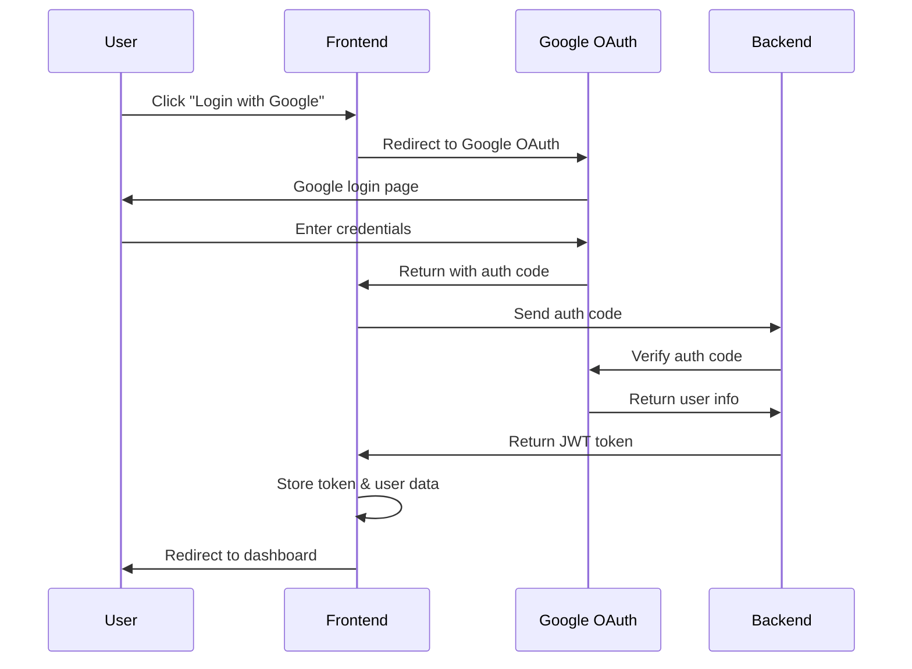

# 🏗️ Ottawa GenAI Research Assistant - System Architecture Guide

## 📊 Overall System Architecture

The Ottawa GenAI Research Assistant adopts a modern **full-stack architecture** with clear separation of concerns, featuring a **React frontend** with TypeScript for type safety, a **FastAPI backend** with layered architecture, and **Google OAuth 2.0** authentication. The system is designed for scalability, maintainability, and seamless bilingual (English/French) support.

```
┌─────────────────────────────────────────────────────────────────┐
│                    🎨 Frontend Layer (React + TypeScript)       │
│                    - User Interface Components                  │
│                    - Google OAuth 2.0 Authentication           │
│                    - English/French Bilingual Support          │
│                    - WCAG 2.1 Accessibility Standards          │
└─────────────────────────┬───────────────────────────────────────┘
                          │ HTTP/REST API + WebSocket
                          ▼
┌─────────────────────────────────────────────────────────────────┐
│                    🚀 Backend Layer (FastAPI)                  │
│                                                                 │
│  ┌─────────────────────────────────────────────────────────┐   │
│  │                 API Layer (FastAPI)                    │   │
│  │               - HTTP endpoint management               │   │
│  │               - Request/Response validation            │   │
│  │               - Authentication & Authorization         │   │
│  │               - Error handling & responses             │   │
│  └─────────────────────┬───────────────────────────────────┘   │
│                        │ Function calls                        │
│                        ▼                                       │
│  ┌─────────────────────────────────────────────────────────┐   │
│  │                Service Layer                           │   │
│  │               - Business logic implementation          │   │
│  │               - AI chat processing (OpenAI)            │   │
│  │               - Document processing                    │   │
│  │               - Report generation                      │   │
│  │               - Process orchestration                  │   │
│  └─────────────────────┬───────────────────────────────────┘   │
│                        │ Data operations                       │
│                        ▼                                       │
│  ┌─────────────────────────────────────────────────────────┐   │
│  │              Repository Layer                          │   │
│  │               - Data access abstraction                │   │
│  │               - CRUD operations implementation         │   │
│  │               - Query method encapsulation             │   │
│  │               - Model conversion handling              │   │
│  └─────────────────────┬───────────────────────────────────┘   │
│                        │ File operations                       │
│                        ▼                                       │
│  ┌─────────────────────────────────────────────────────────┐   │
│  │             Storage Layer (monk/ directory)            │   │
│  │               - JSON file storage                      │   │
│  │               - Document file management               │   │
│  │               - Simple file system                     │   │
│  │               - Easy backup & migration                │   │
│  └─────────────────────────────────────────────────────────┘   │
└─────────────────────────────────────────────────────────────────┘
```

## 🎨 Frontend Architecture

### Core Technologies
- **React 18** with TypeScript for component-based UI
- **Google OAuth 2.0** for secure authentication
- **Context API** for state management
- **CSS Modules** for styling
- **Accessibility**: WCAG 2.1 compliance

### Frontend Directory Structure
```
frontend/
├── public/                 # Static assets
│   ├── index.html         # HTML template
│   ├── favicon.ico        # Website icon
│   └── manifest.json      # PWA configuration
├── src/                   # Source code
│   ├── components/        # Reusable components
│   │   ├── auth/         # Authentication components
│   │   │   ├── GoogleLogin.tsx      # Google OAuth login
│   │   │   ├── ProtectedRoute.tsx   # Route protection
│   │   │   └── AuthCallback.tsx     # OAuth callback handler
│   │   ├── ui/           # UI components
│   │   │   ├── Button.tsx           # Button component
│   │   │   ├── Input.tsx            # Input component
│   │   │   ├── Modal.tsx            # Modal component
│   │   │   └── LoadingSpinner.tsx   # Loading indicator
│   │   ├── Navbar.tsx              # Navigation bar
│   │   └── Navbar.css              # Navigation styles
│   ├── pages/            # Page components
│   │   ├── HomePage.tsx            # Home page
│   │   ├── ChatPage.tsx            # AI chat interface
│   │   ├── DocumentUploadPage.tsx  # Document upload
│   │   ├── ReportPage.tsx          # Report generation
│   │   └── SettingsPage.tsx        # User settings
│   ├── contexts/         # React Context providers
│   │   ├── AuthContext.tsx        # Authentication state
│   │   ├── LanguageContext.tsx     # Language/i18n management
│   │   └── ThemeContext.tsx        # Theme management
│   ├── services/         # Service layer
│   │   ├── api.ts                 # API service
│   │   ├── authService.ts         # Authentication service
│   │   └── mockApi.ts             # Mock data service
│   ├── config/           # Configuration
│   │   └── googleAuth.ts          # Google OAuth config
│   ├── mock/             # Mock data (development)
│   │   ├── data/                  # Mock datasets
│   │   └── api/                   # Mock API implementations
│   ├── App.tsx           # Root component
│   └── index.tsx         # Application entry point
├── package.json          # Project configuration
├── tsconfig.json         # TypeScript configuration
└── Dockerfile           # Container configuration
```

### Authentication Flow


### State Management Strategy
- **AuthContext**: User authentication state, login/logout functions
- **LanguageContext**: English/French language switching
- **ThemeContext**: UI theme management
- **Local State**: Component-specific state using useState/useReducer

## 🚀 Backend Architecture

### Core Technologies
- **FastAPI** for high-performance API development
- **Pydantic** for data validation and serialization
- **JSON file storage** for simple data persistence
- **OpenAI API** for AI-powered chat functionality
- **JWT** for secure authentication

### Backend Directory Structure
```
backend/
├── app/                   # Application core
│   ├── api/              # API layer - FastAPI endpoints
│   │   ├── __init__.py
│   │   ├── chat.py       # Chat conversation interface
│   │   ├── documents.py  # Document management interface
│   │   ├── reports.py    # Report generation interface
│   │   ├── users.py      # User management interface
│   │   └── settings.py   # System settings interface
│   ├── core/             # Core configuration & utilities
│   │   ├── __init__.py
│   │   ├── config.py     # Configuration management
│   │   └── security.py   # Security & authentication
│   ├── models/           # Pydantic data models
│   │   ├── __init__.py
│   │   ├── user.py       # User data model
│   │   ├── document.py   # Document data model
│   │   ├── report.py     # Report data model
│   │   └── chat.py       # Chat data model
│   ├── repositories/     # Repository layer - Data access
│   │   ├── __init__.py
│   │   ├── base.py       # Base repository class
│   │   ├── user_repository.py      # User repository
│   │   ├── document_repository.py  # Document repository
│   │   ├── report_repository.py    # Report repository
│   │   └── chat_repository.py      # Chat repository
│   ├── services/         # Service layer - Business logic
│   │   ├── __init__.py
│   │   ├── user_service.py         # User service
│   │   ├── document_service.py     # Document service
│   │   ├── report_service.py       # Report service
│   │   └── chat_service.py         # AI chat service
│   └── main.py          # FastAPI application entry point
├── monk/                 # Data storage directory
│   ├── users/           # User data files
│   ├── documents/       # Document files
│   ├── reports/         # Generated reports
│   └── chats/           # Chat conversations
├── uploads/             # File upload directory
├── docs/                # Backend documentation
└── requirements.txt     # Python dependencies
```

### API Endpoints Overview
```
📋 Core API Endpoints:

🔐 Authentication
  POST   /api/auth/login          # User login
  POST   /api/auth/logout         # User logout
  GET    /api/auth/me             # Get current user

👤 User Management
  GET    /api/users               # List users
  POST   /api/users               # Create user
  GET    /api/users/{id}          # Get user by ID
  PUT    /api/users/{id}          # Update user
  DELETE /api/users/{id}          # Delete user

💬 Chat Interface
  POST   /api/chat/message        # Send chat message
  GET    /api/chat/history        # Get chat history
  DELETE /api/chat/{id}           # Delete conversation

📄 Document Management
  POST   /api/documents/upload    # Upload document
  GET    /api/documents           # List documents
  GET    /api/documents/{id}      # Get document
  DELETE /api/documents/{id}      # Delete document

📊 Report Generation
  POST   /api/reports/generate    # Generate report
  GET    /api/reports             # List reports
  GET    /api/reports/{id}        # Get report
  DELETE /api/reports/{id}        # Delete report

⚙️ System Settings
  GET    /api/settings            # Get settings
  PUT    /api/settings            # Update settings
```

## 🗄️ Data Architecture

### Storage Strategy
The system uses **JSON file storage** through the `monk/` directory for simplicity and easy migration:

```
monk/
├── users/
│   ├── user_123.json           # Individual user data
│   └── user_456.json
├── documents/
│   ├── doc_789.json            # Document metadata
│   └── doc_012.json
├── reports/
│   ├── report_345.json         # Generated reports
│   └── report_678.json
└── chats/
    ├── chat_901.json           # Chat conversations
    └── chat_234.json
```

### Repository Pattern
All data access follows the **Repository Pattern** with:
- **BaseRepository**: Abstract base class with common CRUD operations
- **Specific Repositories**: User, Document, Report, Chat repositories
- **Type Safety**: Generic TypeVar for model type safety
- **JSON Serialization**: Custom serializers for complex objects

### Data Models (Pydantic)
```python
# User Model
class User(BaseModel):
    id: str
    email: str
    name: str
    language_preference: str = "en"
    created_at: datetime
    last_login: Optional[datetime]

# Document Model
class Document(BaseModel):
    id: str
    user_id: str
    filename: str
    content_type: str
    file_path: str
    uploaded_at: datetime
    size: int

# Chat Model
class ChatMessage(BaseModel):
    id: str
    user_id: str
    message: str
    response: str
    language: str
    timestamp: datetime
    context: Optional[str]
```

## 🔄 Service Layer Architecture

### Chat Service (AI Integration)
```python
class ChatService:
    async def process_message(
        self, 
        message: str, 
        language: str = "en",
        context: Optional[str] = None
    ) -> Dict[str, Any]:
        """Process user message with OpenAI integration"""
        
        # Build system prompt based on language
        system_prompt = self._build_system_prompt(language)
        
        # Send to OpenAI API
        response = await self.openai_client.chat.completions.create(
            model="gpt-4",
            messages=[
                {"role": "system", "content": system_prompt},
                {"role": "user", "content": message}
            ]
        )
        
        return {
            "response": response.choices[0].message.content,
            "language": language,
            "timestamp": datetime.now()
        }
```

### Document Service
```python
class DocumentService:
    async def upload_document(
        self, 
        file: UploadFile, 
        user_id: str
    ) -> Document:
        """Handle document upload and processing"""
        
        # Validate file type and size
        self._validate_file(file)
        
        # Save file to uploads directory
        file_path = await self._save_file(file)
        
        # Create document record
        document = Document(
            id=str(uuid.uuid4()),
            user_id=user_id,
            filename=file.filename,
            content_type=file.content_type,
            file_path=file_path,
            uploaded_at=datetime.now(),
            size=file.size
        )
        
        # Save to repository
        return await self.repository.create(document)
```

## 🌐 Internationalization (i18n)

### Language Support Strategy
- **Frontend**: Context-based language switching
- **Backend**: Language parameter in API requests
- **Content**: Separate translation files for EN/FR
- **AI Responses**: Language-specific system prompts

### Implementation
```typescript
// Frontend Language Context
const LanguageContext = createContext<LanguageContextType>({
  language: 'en',
  setLanguage: () => {},
  t: (key: string) => key
});

// Usage in components
const { t, language } = useLanguage();
return <h1>{t('welcome.title')}</h1>;
```

## 🔐 Security Architecture

### Authentication & Authorization
- **Google OAuth 2.0**: Secure third-party authentication
- **JWT Tokens**: Stateless authentication tokens
- **Protected Routes**: Frontend route protection
- **API Security**: Backend endpoint protection

### Security Measures
- **HTTPS**: Encrypted communication
- **CORS**: Cross-origin request protection
- **Input Validation**: Pydantic model validation
- **File Upload Security**: Type and size validation
- **Rate Limiting**: API rate limiting (future)

## 📱 Deployment Architecture

### Development Environment
```yaml
# Docker Compose Structure
services:
  frontend:
    build: ./frontend
    ports:
      - "3000:3000"
    environment:
      - REACT_APP_API_URL=http://localhost:8000
      
  backend:
    build: ./backend
    ports:
      - "8000:8000"
    environment:
      - OPENAI_API_KEY=${OPENAI_API_KEY}
    volumes:
      - ./backend/monk:/app/monk
```

### Production Considerations
- **Frontend**: Static hosting (Vercel, Netlify)
- **Backend**: Container deployment (Docker)
- **Storage**: Volume mounts for data persistence
- **Monitoring**: Health check endpoints
- **Scalability**: Horizontal scaling ready

## 🚀 Future Architecture Enhancements

### Planned Improvements
1. **Database Migration**: PostgreSQL with SQLAlchemy
2. **Caching Layer**: Redis for session and data caching
3. **Message Queue**: Celery for background tasks
4. **WebSocket**: Real-time chat functionality
5. **Microservices**: Service decomposition for scale
6. **API Gateway**: Centralized API management
7. **Monitoring**: Comprehensive logging and metrics

### Scalability Roadmap
```
Phase 1: Current (JSON + FastAPI + React)
    ↓
Phase 2: Database + Caching (PostgreSQL + Redis)
    ↓
Phase 3: Microservices + Message Queue
    ↓
Phase 4: Container Orchestration (Kubernetes)
    ↓
Phase 5: Cloud-Native (Serverless + CDN)
```

---

## 📚 Related Documentation

### 🏠 Main Project
- [📖 Main README](../README.md) - Project overview and quick start guide

### 📋 English Documentation
- [🗄️ Data Management Guide](./Data%20Management%20Guide.md) - Data management strategies and implementation
- [📊 Project Status Report](./Project%20Status%20Report.md) - Current project status and progress
- [📋 Product Requirements Document (PRD)](./Product%20Requirements%20Document%20(PRD).md) - Product requirements and specifications

### 📋 Chinese Documentation | 中文文档
- [🏗️ 系统架构指南](./系统架构指南.md) - 系统架构说明（中文版）
- [🗄️ 数据管理指南](./数据管理指南.md) - 数据管理策略（中文版）
- [📊 项目现状报告](./项目现状报告.md) - 项目状态报告（中文版）
- [📋 产品需求文档（PRD）](./产品需求文档（PRD）.md) - 产品需求文档（中文版） 