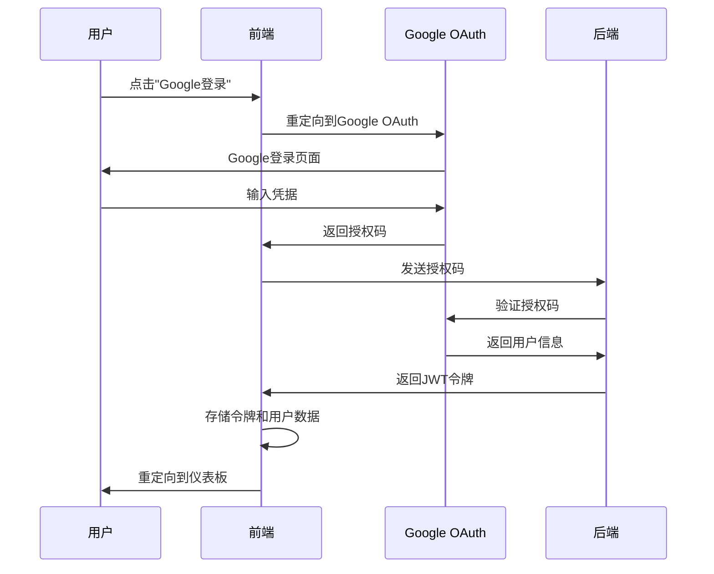

# 🏗️ 渥太华生成式AI研究助手 - 系统架构指南

## 📊 整体系统架构

渥太华生成式AI研究助手采用现代**全栈架构**设计，具有清晰的关注点分离，包含**React前端**（TypeScript类型安全）、**FastAPI后端**（分层架构）和**Google OAuth 2.0**身份验证。系统设计注重可扩展性、可维护性和无缝双语（英语/法语）支持。

```
┌─────────────────────────────────────────────────────────────────┐
│                    🎨 前端层 (React + TypeScript)               │
│                    - 用户界面组件                               │
│                    - Google OAuth 2.0 身份验证                 │
│                    - 英语/法语双语支持                          │
│                    - WCAG 2.1 无障碍标准                       │
└─────────────────────────┬───────────────────────────────────────┘
                          │ HTTP/REST API + WebSocket
                          ▼
┌─────────────────────────────────────────────────────────────────┐
│                    🚀 后端层 (FastAPI)                         │
│                                                                 │
│  ┌─────────────────────────────────────────────────────────┐   │
│  │                 API层 (FastAPI)                       │   │
│  │               - HTTP端点管理                          │   │
│  │               - 请求/响应验证                         │   │
│  │               - 身份验证与授权                        │   │
│  │               - 错误处理与响应                        │   │
│  └─────────────────────┬───────────────────────────────────┘   │
│                        │ 函数调用                              │
│                        ▼                                       │
│  ┌─────────────────────────────────────────────────────────┐   │
│  │                服务层 (Services)                      │   │
│  │               - 业务逻辑实现                          │   │
│  │               - AI聊天处理 (OpenAI)                   │   │
│  │               - 文档处理                              │   │
│  │               - 报告生成                              │   │
│  │               - 流程编排管理                          │   │
│  └─────────────────────┬───────────────────────────────────┘   │
│                        │ 数据操作                              │
│                        ▼                                       │
│  ┌─────────────────────────────────────────────────────────┐   │
│  │              仓储层 (Repository)                      │   │
│  │               - 数据访问抽象                          │   │
│  │               - CRUD操作实现                          │   │
│  │               - 查询方法封装                          │   │
│  │               - 模型转换处理                          │   │
│  └─────────────────────┬───────────────────────────────────┘   │
│                        │ 文件操作                              │
│                        ▼                                       │
│  ┌─────────────────────────────────────────────────────────┐   │
│  │             存储层 (monk/ 目录)                       │   │
│  │               - JSON文件存储                          │   │
│  │               - 文档文件管理                          │   │
│  │               - 简单文件系统                          │   │
│  │               - 易于备份迁移                          │   │
│  └─────────────────────────────────────────────────────────┘   │
└─────────────────────────────────────────────────────────────────┘
```

## 🎨 前端架构

### 核心技术栈
- **React 18** 与 TypeScript 实现组件化UI
- **Google OAuth 2.0** 提供安全身份验证
- **Context API** 进行状态管理
- **CSS Modules** 样式管理
- **无障碍性**: WCAG 2.1 标准合规

### 前端目录结构
```
frontend/
├── public/                 # 静态资源
│   ├── index.html         # HTML模板
│   ├── favicon.ico        # 网站图标
│   └── manifest.json      # PWA配置
├── src/                   # 源代码
│   ├── components/        # 可复用组件
│   │   ├── auth/         # 身份验证组件
│   │   │   ├── GoogleLogin.tsx      # Google OAuth登录
│   │   │   ├── ProtectedRoute.tsx   # 路由保护
│   │   │   └── AuthCallback.tsx     # OAuth回调处理
│   │   ├── ui/           # UI组件
│   │   │   ├── Button.tsx           # 按钮组件
│   │   │   ├── Input.tsx            # 输入组件
│   │   │   ├── Modal.tsx            # 模态框组件
│   │   │   └── LoadingSpinner.tsx   # 加载指示器
│   │   ├── Navbar.tsx              # 导航栏
│   │   └── Navbar.css              # 导航栏样式
│   ├── pages/            # 页面组件
│   │   ├── HomePage.tsx            # 首页
│   │   ├── ChatPage.tsx            # AI聊天界面
│   │   ├── DocumentUploadPage.tsx  # 文档上传
│   │   ├── ReportPage.tsx          # 报告生成
│   │   └── SettingsPage.tsx        # 用户设置
│   ├── contexts/         # React Context提供者
│   │   ├── AuthContext.tsx        # 身份验证状态
│   │   ├── LanguageContext.tsx     # 语言/国际化管理
│   │   └── ThemeContext.tsx        # 主题管理
│   ├── services/         # 服务层
│   │   ├── api.ts                 # API服务
│   │   ├── authService.ts         # 身份验证服务
│   │   └── mockApi.ts             # 模拟数据服务
│   ├── config/           # 配置
│   │   └── googleAuth.ts          # Google OAuth配置
│   ├── mock/             # 模拟数据（开发用）
│   │   ├── data/                  # 模拟数据集
│   │   └── api/                   # 模拟API实现
│   ├── App.tsx           # 根组件
│   └── index.tsx         # 应用入口点
├── package.json          # 项目配置
├── tsconfig.json         # TypeScript配置
└── Dockerfile           # 容器配置
```

### 身份验证流程


### 状态管理策略
- **AuthContext**: 用户身份验证状态，登录/退出功能
- **LanguageContext**: 英语/法语语言切换
- **ThemeContext**: UI主题管理
- **本地状态**: 使用 useState/useReducer 的组件特定状态

## 🚀 后端架构

### 核心技术栈
- **FastAPI** 用于高性能API开发
- **Pydantic** 用于数据验证和序列化
- **JSON文件存储** 用于简单数据持久化
- **OpenAI API** 用于AI驱动的聊天功能
- **JWT** 用于安全身份验证

### 后端目录结构
```
backend/
├── app/                   # 应用程序核心
│   ├── api/              # API层 - FastAPI端点
│   │   ├── __init__.py
│   │   ├── chat.py       # 聊天对话接口
│   │   ├── documents.py  # 文档管理接口
│   │   ├── reports.py    # 报告生成接口
│   │   ├── users.py      # 用户管理接口
│   │   └── settings.py   # 系统设置接口
│   ├── core/             # 核心配置与工具
│   │   ├── __init__.py
│   │   ├── config.py     # 配置管理
│   │   └── security.py   # 安全认证
│   ├── models/           # Pydantic数据模型
│   │   ├── __init__.py
│   │   ├── user.py       # 用户数据模型
│   │   ├── document.py   # 文档数据模型
│   │   ├── report.py     # 报告数据模型
│   │   └── chat.py       # 聊天数据模型
│   ├── repositories/     # 仓储层 - 数据访问
│   │   ├── __init__.py
│   │   ├── base.py       # 基础仓储类
│   │   ├── user_repository.py      # 用户仓储
│   │   ├── document_repository.py  # 文档仓储
│   │   ├── report_repository.py    # 报告仓储
│   │   └── chat_repository.py      # 聊天仓储
│   ├── services/         # 服务层 - 业务逻辑
│   │   ├── __init__.py
│   │   ├── user_service.py         # 用户服务
│   │   ├── document_service.py     # 文档服务
│   │   ├── report_service.py       # 报告服务
│   │   └── chat_service.py         # AI聊天服务
│   └── main.py          # FastAPI应用入口点
├── monk/                 # 数据存储目录
│   ├── users/           # 用户数据文件
│   ├── documents/       # 文档文件
│   ├── reports/         # 生成的报告
│   └── chats/           # 聊天对话
├── uploads/             # 文件上传目录
├── docs/                # 后端文档
└── requirements.txt     # Python依赖
```

### API端点概览
```
📋 核心API端点:

🔐 身份验证
  POST   /api/auth/login          # 用户登录
  POST   /api/auth/logout         # 用户退出
  GET    /api/auth/me             # 获取当前用户

👤 用户管理
  GET    /api/users               # 列出用户
  POST   /api/users               # 创建用户
  GET    /api/users/{id}          # 根据ID获取用户
  PUT    /api/users/{id}          # 更新用户
  DELETE /api/users/{id}          # 删除用户

💬 聊天界面
  POST   /api/chat/message        # 发送聊天消息
  GET    /api/chat/history        # 获取聊天历史
  DELETE /api/chat/{id}           # 删除对话

📄 文档管理
  POST   /api/documents/upload    # 上传文档
  GET    /api/documents           # 列出文档
  GET    /api/documents/{id}      # 获取文档
  DELETE /api/documents/{id}      # 删除文档

📊 报告生成
  POST   /api/reports/generate    # 生成报告
  GET    /api/reports             # 列出报告
  GET    /api/reports/{id}        # 获取报告
  DELETE /api/reports/{id}        # 删除报告

⚙️ 系统设置
  GET    /api/settings            # 获取设置
  PUT    /api/settings            # 更新设置
```

## 🗄️ 数据架构

### 存储策略
系统通过 `monk/` 目录使用**JSON文件存储**，简单且易于迁移：

```
monk/
├── users/
│   ├── user_123.json           # 单个用户数据
│   └── user_456.json
├── documents/
│   ├── doc_789.json            # 文档元数据
│   └── doc_012.json
├── reports/
│   ├── report_345.json         # 生成的报告
│   └── report_678.json
└── chats/
    ├── chat_901.json           # 聊天对话
    └── chat_234.json
```

### 仓储模式
所有数据访问遵循**仓储模式**，包含：
- **BaseRepository**: 具有通用CRUD操作的抽象基类
- **特定仓储**: User、Document、Report、Chat 仓储
- **类型安全**: 用于模型类型安全的泛型 TypeVar
- **JSON序列化**: 复杂对象的自定义序列化器

### 数据模型 (Pydantic)
```python
# 用户模型
class User(BaseModel):
    id: str
    email: str
    name: str
    language_preference: str = "en"
    created_at: datetime
    last_login: Optional[datetime]

# 文档模型
class Document(BaseModel):
    id: str
    user_id: str
    filename: str
    content_type: str
    file_path: str
    uploaded_at: datetime
    size: int

# 聊天模型
class ChatMessage(BaseModel):
    id: str
    user_id: str
    message: str
    response: str
    language: str
    timestamp: datetime
    context: Optional[str]
```

## 🔄 服务层架构

### 聊天服务 (AI集成)
```python
class ChatService:
    async def process_message(
        self, 
        message: str, 
        language: str = "en",
        context: Optional[str] = None
    ) -> Dict[str, Any]:
        """使用OpenAI集成处理用户消息"""
        
        # 根据语言构建系统提示
        system_prompt = self._build_system_prompt(language)
        
        # 发送到OpenAI API
        response = await self.openai_client.chat.completions.create(
            model="gpt-4",
            messages=[
                {"role": "system", "content": system_prompt},
                {"role": "user", "content": message}
            ]
        )
        
        return {
            "response": response.choices[0].message.content,
            "language": language,
            "timestamp": datetime.now()
        }
```

### 文档服务
```python
class DocumentService:
    async def upload_document(
        self, 
        file: UploadFile, 
        user_id: str
    ) -> Document:
        """处理文档上传和处理"""
        
        # 验证文件类型和大小
        self._validate_file(file)
        
        # 保存文件到上传目录
        file_path = await self._save_file(file)
        
        # 创建文档记录
        document = Document(
            id=str(uuid.uuid4()),
            user_id=user_id,
            filename=file.filename,
            content_type=file.content_type,
            file_path=file_path,
            uploaded_at=datetime.now(),
            size=file.size
        )
        
        # 保存到仓储
        return await self.repository.create(document)
```

## 🌐 国际化 (i18n)

### 语言支持策略
- **前端**: 基于Context的语言切换
- **后端**: API请求中的语言参数
- **内容**: 英语/法语独立翻译文件
- **AI响应**: 特定语言的系统提示

### 实现方式
```typescript
// 前端语言Context
const LanguageContext = createContext<LanguageContextType>({
  language: 'en',
  setLanguage: () => {},
  t: (key: string) => key
});

// 在组件中使用
const { t, language } = useLanguage();
return <h1>{t('welcome.title')}</h1>;
```

## 🔐 安全架构

### 身份验证与授权
- **Google OAuth 2.0**: 安全的第三方身份验证
- **JWT令牌**: 无状态身份验证令牌
- **保护路由**: 前端路由保护
- **API安全**: 后端端点保护

### 安全措施
- **HTTPS**: 加密通信
- **CORS**: 跨源请求保护
- **输入验证**: Pydantic模型验证
- **文件上传安全**: 类型和大小验证
- **速率限制**: API速率限制（未来）

## 📱 部署架构

### 开发环境
```yaml
# Docker Compose 结构
services:
  frontend:
    build: ./frontend
    ports:
      - "3000:3000"
    environment:
      - REACT_APP_API_URL=http://localhost:8000
      
  backend:
    build: ./backend
    ports:
      - "8000:8000"
    environment:
      - OPENAI_API_KEY=${OPENAI_API_KEY}
    volumes:
      - ./backend/monk:/app/monk
```

### 生产环境考虑
- **前端**: 静态托管 (Vercel, Netlify)
- **后端**: 容器部署 (Docker)
- **存储**: 数据持久化的卷挂载
- **监控**: 健康检查端点
- **可扩展性**: 水平扩展就绪

## 🚀 未来架构增强

### 计划改进
1. **数据库迁移**: PostgreSQL 与 SQLAlchemy
2. **缓存层**: Redis 用于会话和数据缓存
3. **消息队列**: Celery 用于后台任务
4. **WebSocket**: 实时聊天功能
5. **微服务**: 服务分解以实现扩展
6. **API网关**: 集中式API管理
7. **监控**: 全面的日志记录和指标

### 可扩展性路线图
```
阶段1: 当前 (JSON + FastAPI + React)
    ↓
阶段2: 数据库 + 缓存 (PostgreSQL + Redis)
    ↓
阶段3: 微服务 + 消息队列
    ↓
阶段4: 容器编排 (Kubernetes)
    ↓
阶段5: 云原生 (无服务器 + CDN)
```

---

## 📚 相关文档

### 🏠 主项目
- [📖 项目主页](../README.md) - 项目概览和快速开始指南

### 📋 English Documentation | 英文文档
- [🏗️ System Architecture Guide](./System%20Architecture%20Guide.md) - Complete system architecture (English)
- [🗄️ Data Management Guide](./Data%20Management%20Guide.md) - Data management strategies (English)
- [📊 Project Status Report](./Project%20Status%20Report.md) - Current project status (English)
- [📋 Product Requirements Document (PRD)](./Product%20Requirements%20Document%20(PRD).md) - Product requirements (English)

### 📋 中文文档
- [🗄️ 数据管理指南](./数据管理指南.md) - 数据管理策略和实现
- [📊 项目现状报告](./项目现状报告.md) - 当前项目状态和进展
- [📋 产品需求文档（PRD）](./产品需求文档（PRD）.md) - 产品需求和规格说明 